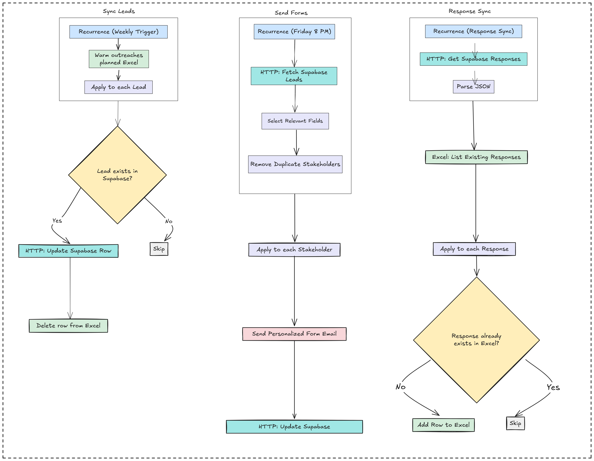

##  Warm Lead Whisperer Survey

This project automates **personalized stakeholder outreach** and feedback collection for warm leads using Microsoft Power Automate, Excel (SharePoint), and Supabase. It enables SDR teams to:

* `Upload weekly warm leads.`
* `Dynamically generate and send stakeholder-specific Microsoft Forms.`
* `Log responses and sync them across Supabase and SharePoint.`

---

##  Features

*  **Automated stakeholder email outreach** with unique form URLs.
*  **Dynamic form generation** based on lead-stakeholder mapping.
*  **Scheduled weekly email jobs** (e.g., every Friday at 8 PM).
*  **Logs responses** into a SharePoint Excel table.
*  Fully no-code compatible using **Power Automate** flows and REST APIs.

---

##  Technologies Used

| Layer            | Tool/Service                |
| ---------------- | --------------------------- |
| Automation       | Power Automate              |
| Backend Database | Supabase (PostgreSQL)       |
| Storage          | Excel (SharePoint hosted)   |
| Form Collection  | Custom React Forms          |
| Scheduling       | Recurrence                  |

---

## Flow Overview

---

##  Setup Instructions

1. **SharePoint Excel File**

   * Store `Warm outreaches planned.xlsx` with a table named `LeadsTable`
   * Store `Stakeholder Responses.xlsx` with a table named `FinalResponsesTable`

2. **Supabase Setup**

   * Tables: `leads_with_status`, `stakeholder_responses`
   * API Key and endpoint must be set up in Power Automate's HTTP steps

3. **Custom React Form**

   * Create one form with dynamic questions per stakeholder
   * Form URLs are generated and sent via email

4. **Power Automate Flows**

   * Create and import the flows:

     * `1. SyncLeadsToSupabase`
     * `2. Send Weekly Stakeholder Forms`
     * `3. SupabaseToSharePoint`

---

##  Scheduling

* Each flow is triggered via `Recurrence` (set to your preferred time)
* Emails go out only if the stakeholder has leads with `status = Not Done`

---

##  Bonus Logic

* Only sends forms to stakeholders with **at least one open lead**
* Logs `email_status` back to Supabase
* Updates `status = Done` in Excel once response is synced

---

##  Author

**Shubham Vishwas Puranik**
[GitHub @shubh6-max](https://github.com/shubh6-max)
